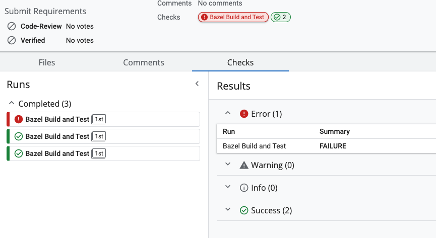

# checks-gha

A gerrit plugin to report status from GitHub Actions. If you're using a similar pattern to cue (https://www.youtube.com/watch?v=2B2PZTZlPJg) to integrate github actions and gerrit, you can use this plugin to report GitHub statuses back to your Gerrit page.



## Installation

Currently, this plugin is only compatible with Gerrit 3.8.
Download the latest release from the [releases](https://github.com/DolceTriade/checks-gha/releases) page and install the plugin to gerrit by placing it in your `plugins/` directory.

## Configuration

Add the following entry to your `gerrit.config`:

```
[plugin "checks-gha"]
    username = <github username>
    pat = <github PAT>
```

Note that in order to use this plugin, you must name your GitHub branches like `ci/<change id>/<revision>`.